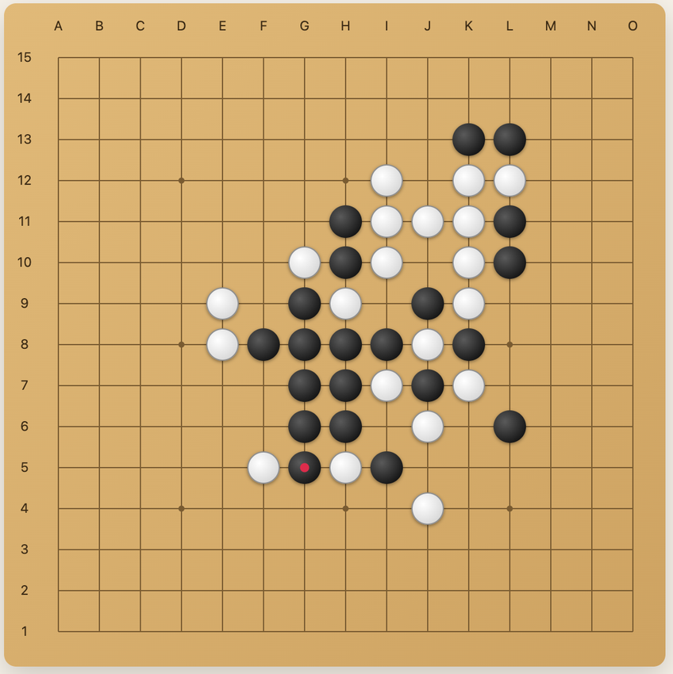
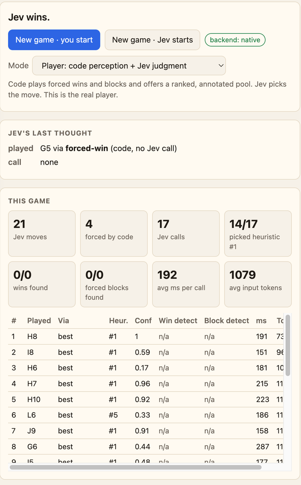
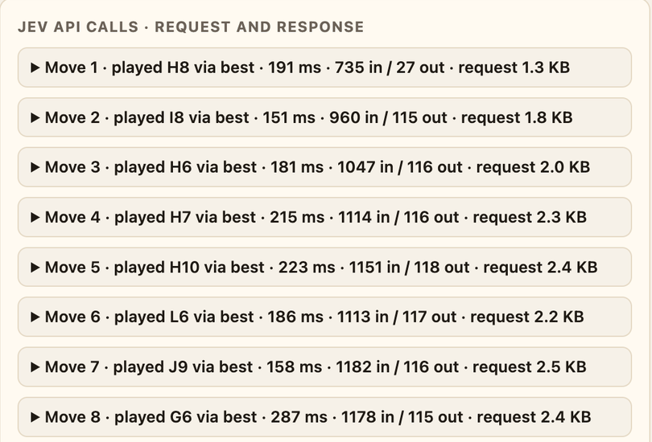

# jev-go — Can you beat Jev at Gomoku, Go or chess?

**Live:** https://jev-go.chardonn.ai

Play 15×15 Gomoku, 9×9 Go or chess against **Jev**, TypeSafe AI's System One decision model.
Code does the perception, Jev does the judgment, and every API call is shown on the page.
Hosted on **Cloudflare Pages** with three Pages Functions, one per game.



## Three modes

| mode | what code does | what Jev sees | who decides |
|---|---|---|---|
| **Player** (default) | full perception: fives, open/closed/split fours, open threes, forks, "this move loses next turn"; plays forced wins and blocks itself; prunes to a ranked pool of ~12 candidates | one `choice` question over the pool, each option annotated with exactly what it creates and blocks, plus a threat summary in the state | code for forced tactics, **Jev for everything else** |
| **Assisted** | annotates every empty point with the same line facts | three `choice` questions (`win_now`, `must_block`, `best_move`) over all empty points | Jev; win/block claims are verified before being played |
| **Naked** | nothing | the same three questions, every empty point, no descriptions | Jev alone. Measurement mode. |

In Player mode the page shows where Jev's pick ranked in the code heuristic's ordering
("Heur. #k"), so you can see whether Jev's judgment agrees with, beats, or ignores the
1-ply evaluation. Forced moves are logged as `forced-win`, `forced-block` and `open-four`
and cost no call.

Every Jev call's full request payload and raw response are shown in the **Jev API calls**
panel, one expandable entry per move, with copy buttons.

## Go 9×9

The same three modes apply. Code implements captures, suicide, **positional superko**, area
scoring (Chinese rules, komi 7.5) and two-pass game end, replaying the move list on every
request so the history is authoritative. For every legal point it computes what the move
captures, saves, threatens (atari), connects, whether it is self-atari or fills an own eye,
the line, and the liberties left, and ranks them.

- **Player**: Jev picks from the top ~12 annotated points; `pass` is offered only after the
  opponent passed, when nothing scores, or near the 200-move cap.
- **Assisted / Naked**: every legal point plus `pass`; questions are `capture_now`,
  `must_save` and `best_move`, verified against code truth before being played.

Dead stones are not removed at the end, so capture them before passing.

## Screenshots

Player mode, Jev (white) wins a Gomoku game. Right panel: the last call, per-move table
with where Jev's pick ranked in the heuristic, and the API log.



Every call, expandable, with the exact request and Jev's raw response:



## Chess

Standard chess with rules from the vendored [chess.js](https://github.com/jhlywa/chess.js) 1.4.0
(BSD-2-Clause, `functions/_lib/vendor/`). X is White. The server returns an HMAC-signed snapshot of the
position (FEN plus a repetition table) that the client sends back, so a request loads the position in
microseconds instead of replaying the move list; the list is still sent as context for Jev, and a request
without a valid snapshot falls back to replaying it. For every legal move code computes what it captures, whether the moved
piece can be taken back (attacked and undefended, or by something cheaper; a king only takes an
undefended piece), what other piece it leaves en prise, what it threatens, check, mate, castling,
development, and ranks them. Piece safety is a static exchange over every attacker and defender on the
square (pinned pieces are treated as free to move); there is no search.

- **Player**: code plays mate in one; otherwise Jev picks from the top 12 annotated moves.
- **Assisted / Naked**: every legal move, in SAN order; questions `mate_now`, `win_material`,
  `best_move`, verified before being played.

## Leaderboard and replays

Every verified game is recorded by the server: one row per game and one per ply, including Jev's
top-5 probabilities, the probability it gave the move it played, verdicts, latency, tokens and the
raw request/response. A game is verified when it was played move by move through the signed session
token the server issues (all three games use one now), so a recorded win was produced on the server,
not posted by a client. Games played without a key (mock) are recorded but never count.

- **Leaderboard** (`GET /api/leaderboard?game=gomoku`): human wins against the real Jev, fewest
  plies first, with the model version. Winners can claim a display name once (`POST /api/claim`).
- **Replay** (`?replay=<id>` on the page, `GET /api/game/<id>`): step through any recorded game with
  Jev's thoughts on every one of its moves.

Storage is Cloudflare D1. Create it once and bind it (see `wrangler.toml`):

```bash
npx wrangler d1 create jev-go                                   # copy the database_id into wrangler.toml
npx wrangler d1 execute jev-go --remote --file=schema.sql       # create the tables
```

Without the binding the server keeps records in memory only.

## Layout

```
functions/api/move.js     Pages Function: POST /api/move (Gomoku)
functions/api/go.js       Pages Function: POST /api/go   (Go 9×9)
functions/api/chess.js    Pages Function: POST /api/chess
functions/api/leaderboard.js, game/[id].js, claim.js   records API
functions/_lib/session.js, store.js, records.js         signed sessions, D1/memory store, read cores
functions/_lib/move.js    runtime-agnostic core (prompt build, Jev call, verify, decide)
functions/_lib/gomoku.js  Gomoku threat engine, candidate ranking, descriptions
functions/_lib/go.js      Go engine: groups, captures, superko, scoring, annotations
functions/_lib/go_move.js Go handler core
functions/_lib/chess.js   chess annotations on top of vendored chess.js
functions/_lib/chess_move.js chess handler core
functions/_lib/jev.js     shared Jev transport (TypeSafe API, or a mock when no key is set)
public/index.html         the page
dev.mjs                   plain Node dev server (no wrangler needed)
test.mjs                  node:test suite
wrangler.toml             Pages project config
```

## Backend selection

With `TYPESAFE_API_KEY` set, every move is one `POST https://api.typesafe.ai/v1/systemone` with model
`jev-latest`. Without it the server plays a heuristic stand-in and the page badge reads "opponent: mock, no key" instead of "opponent: Jev, live", so the
app runs locally with no key. `STATE_SECRET` optionally signs the chess state tokens; it defaults to the API key.

## Run locally

```bash
cp .dev.vars.example .dev.vars   # paste TYPESAFE_API_KEY, or leave empty for mock mode
npm test
npm run dev                      # plain Node, http://localhost:3000
npm run cf:dev                   # or the real Pages runtime via wrangler, http://localhost:8788
```

## Deploy to Cloudflare Pages

```bash
npx wrangler login                                   # once
npx wrangler pages deploy public                     # creates the project "jev-go" on first run
npx wrangler pages secret put TYPESAFE_API_KEY       # paste the key when prompted
npx wrangler pages deploy public                     # deploy again so the secret is live
```

The site lands at `https://jev-go.pages.dev`. Until the secret is set, the deployed page runs
in mock mode.

## Cost

Jev bills input only, $0.042 per million tokens. Measured: Player mode is about 1,100 input tokens
per call (a 20-call Gomoku game costs about a tenth of a cent); Naked and Assisted send every empty
point and run about 13,000 tokens per call on Gomoku, far fewer on Go and chess. Either way a game
is well under a cent.
