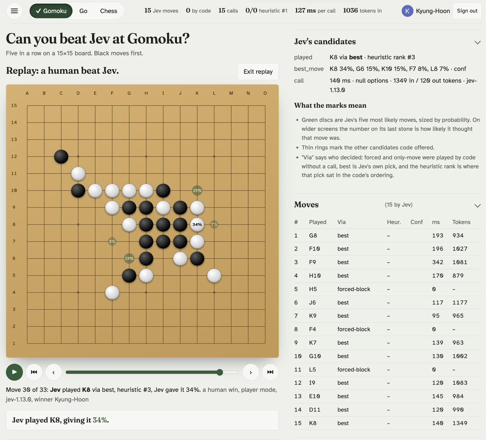
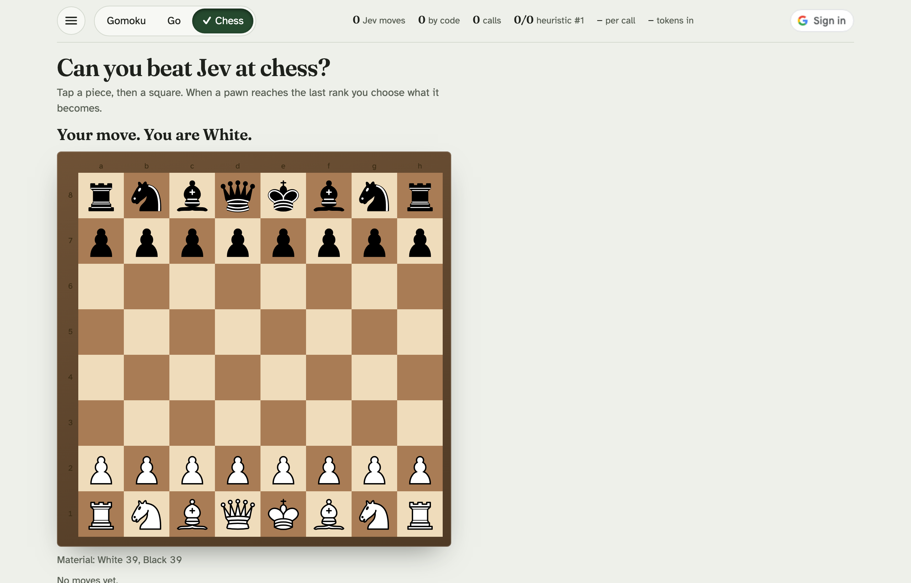
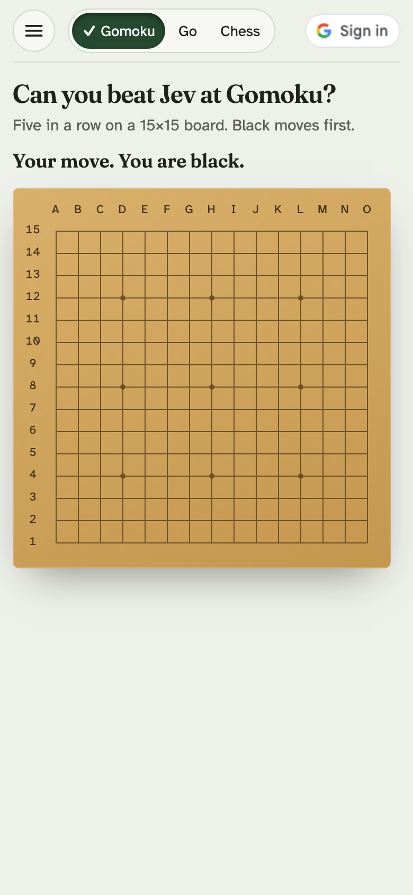
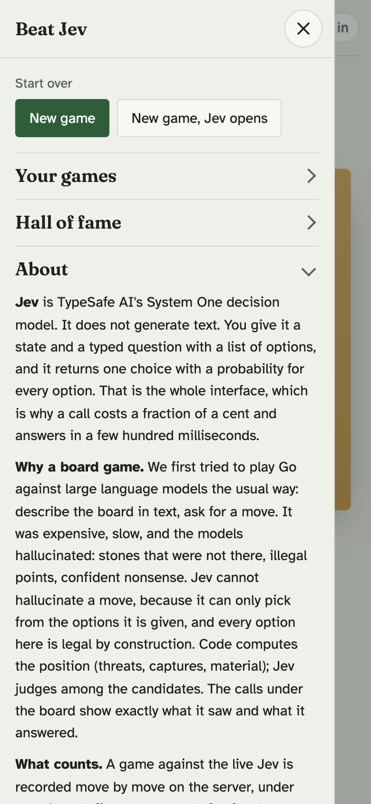

# Beat Jev — can you beat a decision model at Gomoku, Go or chess?

**Live:** https://jev-go.chardonn.ai

Play 15×15 Gomoku, 9×9 Go or chess against **Jev**, TypeSafe AI's System One decision model. Jev
does not generate text: it takes a state and a typed question with a list of options and returns one
choice with a probability for every option. Code does the perception, Jev does the judgment, and
every call to Jev is shown under the board, request and raw response. Beat it and your name goes on
the hall of fame.

Hosted on **Cloudflare Pages** (static page plus Pages Functions), records in **D1**, sign-in with
Google.



*A replay of a human win: Jev's five most likely moves drawn on the board, its candidates beside it, and every move's who-decided, rank, latency and tokens.*

## Why a board game

We first tried to play Go against large language models the usual way: describe the board in text,
ask for a move. It was expensive, slow, and the models hallucinated: stones that were not there,
illegal points, confident nonsense. Jev cannot hallucinate a move, because it can only pick from the
options it is given, and every option here is legal by construction. That is the doctrine of this
site: **code computes, Jev judges.**

## How Jev plays

Every move is one call. Code builds the position and a ranked, annotated pool of candidates; Jev
answers one `choice` question over the pool and the page plays its pick. Forced tactics are played by
code without a call (a five, an open four, a forced block, mate in one) and are logged as such.

- **Gomoku 15×15**: code sees fives, open/closed/split fours, open threes and forks, and runs a bounded
  forcing search for every candidate: does the opponent win by force after it, through an unstoppable
  threat at once, a four or an open three that no reply holds, or the block of our own four? Moves that
  lose are dropped, a four is kept only when the position after its forced block still holds, and when no
  checked move holds code plays the longest defence itself (the block of the biggest threat) and says so. Code plays forced wins and blocks, and hands Jev about twelve holding candidates, each
  annotated with what it creates and which opponent shape it blocks, plus a threat summary in the state.
  The search is a bound, not a proof: it tries every opponent four and the six strongest open threes per
  move under a fixed evaluation budget (about five to twelve milliseconds on a laptop). When the budget runs
  out first, Jev gets the moves checked so far, blocks first, and the decision's note says so.
- **Go 9×9**: captures, suicide, **positional superko**, area scoring (Chinese rules, komi 7.5),
  two-pass game end. For every legal point code computes what the move captures, saves, threatens
  (atari), connects, whether it is self-atari or fills an own eye, the line and the liberties left;
  Jev picks from the top twelve. `pass` is offered only after the opponent passed, when nothing
  scores, or near the 200-move cap. Dead stones are not removed at the end, so capture them first.
- **Chess**: rules from the vendored [chess.js](https://github.com/jhlywa/chess.js) 1.4.0
  (BSD-2-Clause, `functions/_lib/vendor/`); you are White unless you choose "New game, Jev opens". For every legal move code computes what
  it captures, whether the moved piece can be taken back (a static exchange over every attacker and
  defender on the square; pinned pieces are treated as free to move), what it leaves en prise, what
  it threatens, check, mate, castling and development, and ranks them. Code plays mate in one; Jev
  picks from the top twelve. There is no search. The pieces are Colin M.L. Burnett's SVG set
  ([CC BY-SA 3.0](https://creativecommons.org/licenses/by-sa/3.0/), from
  [Wikimedia Commons](https://commons.wikimedia.org/wiki/Category:SVG_chess_pieces)), combined into one inline sprite.

The page shows where Jev's pick ranked in the code's ordering ("heuristic #k"), so you can see
whether Jev's judgment agrees with, beats, or ignores the one-ply evaluation.



The practice opponent (no key) picks from the same pool with a simple line-length heuristic and a little
randomness, and it is already hard to beat: in Player mode most of the playing strength is the harness,
which offers only moves the search could not refute, and says so when the budget stopped it from checking. Jev's share is the difference between the code's first choice and
Jev's pick, which the page reports as the heuristic rank. To measure Jev alone, use the API-only modes
below.

Two measurement modes remain in the API only (`mode` in the request body), not on the page:
**Assisted** hands Jev every legal point with the same facts attached and verifies its win/block
claims before playing them; **Naked** hands Jev every legal point with no facts at all.

## The page

Built phone-first. The board is measured from its column so it never scrolls sideways. On a phone
the first tap aims a stone (a ghost appears with a "Place H8" button) and the second tap plays it; a
mouse previews on hover and plays on click. Jev's five most likely moves are drawn on the board as
green discs sized by probability after its move, with its own pick's probability on the stone on wider
screens, and they fade when you start yours.

Before Jev's first move the board stands alone. From the first call on, under the board: the status
line, Pass or Place when needed, the result card at game end (with Play again, Share and the replay
link), a one-line card saying what Jev played, how sure it was and why, and **every call to Jev**,
newest first, the newest open, with the exact request and the raw response and copy buttons. Then Jev's
full candidate list with its reasons, and the per-move table (who decided, heuristic rank, confidence,
latency, tokens). The board stays centred in one column for the whole game; only a replay opens a second
column and puts those two panels beside the board.

The top bar holds the menu (new game, Jev opens, your games, hall of fame, about), the game switcher,
this game's numbers in the centre on wide screens, and sign-in. A replay (`?replay=<id>`) counts
three beats over the empty board and then plays itself at about a move a second; it pauses for a hand
step, a tap or a key skips the count, and Jev's thoughts show on every one of its moves.

<p>


</p>

## Sign in with Google

Playing the live Jev needs a Google sign-in: the first touch of the board, Pass, or "New game, Jev opens"
opens a small dialog with Google's button, and the server refuses a live move without a valid session,
so every recorded game and every hall-of-fame win carries a name. Practice games (a server with no
key) stay open.

The browser posts Google's ID token to `POST /api/login`; the server verifies the RS256 signature
against Google's published keys with WebCrypto, checks issuer, audience and expiry, and issues its own
30-day HMAC session. Every move carries the session. `POST /api/me` lists your games with replay links
on any device. If a session expires mid-game, signing in again keeps the game: the login request
carries the game's signed state token, which proves you played it, and the server attaches the game to
the account.

Stored: a hash of the Google subject id and the display name. Never the email or anything from the
mailbox; sign-in requests identity only. The OAuth client id is public and set in the page and in
`functions/_lib/auth.js` (override with a `GOOGLE_CLIENT_ID` variable). Authorized origins:
`https://jev-go.chardonn.ai` and `http://localhost:3111`.

## Records, hall of fame, replays

Every game against the live Jev is recorded on the server: one row per game and one per ply,
including Jev's top-5 probabilities, the probability it gave the move it played, latency, tokens and
the raw request and response. A game is recorded only when it was played move by move through the
signed session token the server issues: the token binds the game id to the exact position, so a
recorded win was produced on the server, never posted by a client, and an older token cannot rewind
a recorded game (the one exception is resending the same move after a lost response). The opponent
mode is sealed into the token too.

- **Hall of fame** (`GET /api/leaderboard?game=gomoku`): human wins against the live Jev, fewest
  plies first, with the model version. The response also carries `backend` (`native` or `mock`) and
  `schema` (`"ok"`, or the database's own error if a column the code writes is missing; the page
  then shows "Not recorded" on every live game).
- **Replay** (`?replay=<id>` on the page, `GET /api/game/<id>`): any recorded game, cached at the
  edge once finished.
- Practice games are recorded and listed under your games, marked as practice, but never count.

Storage is Cloudflare D1, set up in the dashboard: Workers & Pages → D1 → create a database named
`jev-go`, run `schema.sql` in its Console tab, then in the Pages project's Settings → Bindings add a
D1 binding with variable name `DB` for Production and Preview, and redeploy. Without the binding the
server keeps records in memory only.

When `schema.sql` gains a column, an existing database needs the matching file under `migrations/`
run in the same Console tab: `CREATE TABLE IF NOT EXISTS` never alters a table that exists, and a
missing column makes every record write fail silently. The `schema` field on the leaderboard
response is the check.

## Layout

```
public/index.html            the page (inline CSS + JS, the chess piece sprite)
functions/api/move.js        POST /api/move   Gomoku
functions/api/go.js          POST /api/go     Go 9×9
functions/api/chess.js       POST /api/chess
functions/api/login.js, me.js, leaderboard.js, game/[id].js   sign-in and records
functions/_lib/move.js, go_move.js, chess_move.js   handler cores (prompt, Jev call, verify, decide)
functions/_lib/gomoku.js     Gomoku threat engine, candidate ranking, descriptions
functions/_lib/go.js         Go engine: groups, captures, superko, scoring, annotations
functions/_lib/chess.js      chess annotations on top of vendored chess.js
functions/_lib/jev.js        Jev transport (TypeSafe API, or a heuristic stand-in when no key is set)
functions/_lib/session.js    signed game sessions (position, mode), records
functions/_lib/store.js      D1 store and memory store
functions/_lib/records.js    leaderboard, replay, me
functions/_lib/google.js, auth.js, token.js   Google ID token verification, player sessions, HMAC
schema.sql, migrations/      D1 schema and the changes to apply to an existing database
dev.mjs                      plain Node dev server (no wrangler needed)
test.mjs                     node:test suite; the D1 statements run through node:sqlite
wrangler.toml                local-only; the live project is configured in the dashboard
```

## Backend selection

With `TYPESAFE_API_KEY` set, every move is one `POST https://api.typesafe.ai/v1/systemone` with model
`jev-latest`. Without it the server plays a heuristic stand-in, the page says "Practice opponent" next
to the status line, and no sign-in is asked for, so the app runs locally with no key. `STATE_SECRET`
optionally signs the session tokens; it defaults to the API key.

## Run locally

```bash
cp .dev.vars.example .dev.vars   # paste TYPESAFE_API_KEY, or leave empty for the practice opponent
npm test
PORT=3111 npm run dev            # plain Node; 3111 is the origin registered for Google sign-in
npm run cf:dev                   # or the real Pages runtime via wrangler, http://localhost:8788
```

## Deploy to Cloudflare Pages

The project is connected to this GitHub repository in the Cloudflare dashboard: every push to `main`
deploys. Build command empty, output directory `public`. Secrets live in the project's Settings →
Variables and Secrets: `TYPESAFE_API_KEY` (required for the real Jev) and optionally `STATE_SECRET`.
Until the key is set, the deployed page runs with the practice opponent.

## Cost

Jev bills input only, $0.042 per million tokens. Measured: Player mode is about 1,100 input tokens per
call, so a 20-call Gomoku game costs about a tenth of a cent. The API-only Assisted and Naked modes
send every empty point and run about 13,000 tokens per call on Gomoku, far fewer on Go and chess.
Either way a game is well under a cent.
